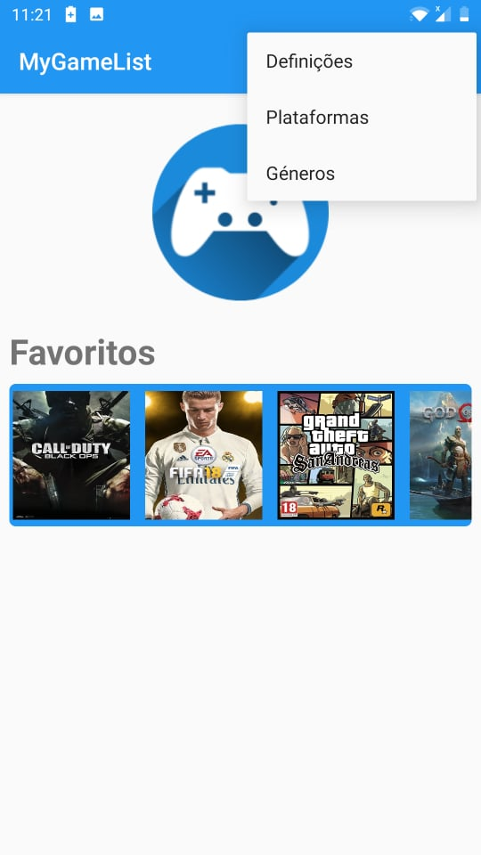
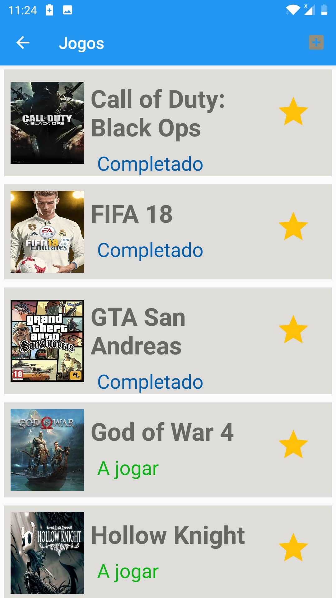

   <!DOCTYPE html>
<html>
<head>
	<meta charset="utf-8"/>
</head>
<body>
  <h1 id="mygamelist">MyGameList</h1>

Base de dados de jogos, plataformas e géneros. Esta base de dados irá conter informação detalhada de jogos onde eu poderei guardar a lista de jogos que joguei e se o completei ou não.

	
Terá 5 tabelas:

  <h4 id="jogos">Jogos: Informação detalhada sobre jogos.</h4>
	
Esta tabela conterá 5 atributos.

  
-ID_jogo; 
  -Nome_jogo; 
  -Image_jogo; 
  -Atividade_jogo; 
  -Data_Lancamento_jogo;

  <h4 id="plataformas">Plataformas: Informação das plataformas.</h4>
  
Esta tabela conterá 2 atributos.
    -ID_plataforma;
    -Nome_plataforma;

 
<h4 id="jogos_plataformas">Jogos_Plataformas: Relação entre as tabelas Jogos e Plataformas.</h4>

Esta tabela conterá 2 atributos.
    -Plataformas_ID_plataforma;
    -Jogos_ID_jogo;

<h4 id="generos">Géneros: Informaçãodos géneros.</h4>

Géneros: Informação detalhada dos géneros.
  Esta tabela conterá 2 atributos.
    -ID_genero;
    -Nome_genero;

  <h4 id="jogos_generos">Jogos_Géneros: Relação entre Jogos e Géneros.</h4>

-Jogos_Géneros: Relação entre Jogos e Géneros.
  Esta tabela conterá 2 atributos.
    -Jogos_ID_jogo;
    -Generos_ID_genero;

    </body>
</html>
    

<html>
<head>
	<meta charset="utf-8"/>
</head>
	<body>
		<h4 id="mainActivity">Main Activity</h4>
	
 Na Main Activity temos os Jogos Favoritos e um menu onde podemos mudar para atividades: Generos, Plataformas e Jogos(O botão da atividade dos jogos está na barra debaixo do menu)

	</body>
	</html>
	

<html>
<head>
	<meta charset="utf-8"/>
</head>
	<body>
		<h4 id="jogosActivity">Jogos Activity</h4>
	
 Temos os items do Jogos onde podemos ver Nome, Atividade, se é um favorito ou não. Desta atividade podemos saltar para a Atividade NovoJogo, ou clicando num dos podemos mudar para uma atividade DetalhesdoJogoActivity. As atividades GenerosActivity e PlataformasActivity são similares a esta mas contêm os seus respetivos objetos

	
	 	
		<h4 id="NovoJogoActivity">NovoJogoActivity</h4>
	
 Nesta atividade podemos adicionar um novo jogo e os seus respetivos parametros. Existem Atividades NovoGenero e NovaPlataforma similares a esta mas com os seus respetivos objetos

	
		 
<h4 id="DetalhesActivity">Detalhes Jogos Activity</h4>
	
 Nesta atividade podemos encontrar mais alguma informação sobre o jogo e temos um menu onde podemos mudar para as atividades EditarJogoActivity e EliminarJogoActivity

	
	</body>
</html>

